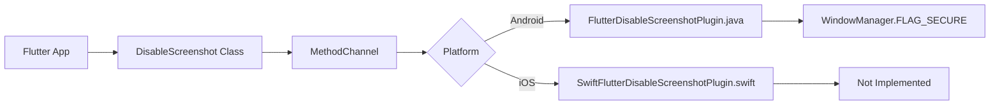

# Flutter Disable Screenshot Plugin - Developer Guide

## Architecture Overview

The `flutter_disable_screenshot` plugin follows the standard Flutter plugin architecture with platform-specific implementations for Android and iOS.

```
flutter_disable_screenshot/
├── lib/
│   └── flutter_disable_screenshot.dart    # Main plugin entry point
├── android/
│   └── src/main/java/.../               # Android implementation
├── ios/
│   └── Classes/                         # iOS implementation
├── example/
│   └── lib/
│       └── disable_screen_shot.dart     # Functional implementation
└── test/
    └── flutter_disable_screenshot_test.dart
```

## Plugin Communication Flow



## Method Channel Communication

### Channel Names
- **Working Implementation**: `flutter_disable_screen_shot`
- **Main Plugin**: `flutter_disable_screenshot` (inconsistent)

### Supported Methods

#### `setDisabled`
**Parameters:**
```json
{
  "disabled": boolean
}
```

**Platform Implementations:**
- **Android**: ✅ Implemented using `FLAG_SECURE`
- **iOS**: ❌ Not implemented (returns platform version)

## Platform-Specific Implementation Details

### Android Implementation

#### Key Components

1. **FlutterDisableScreenshotPlugin.java**
   - Implements `FlutterPlugin`, `MethodChannel.MethodCallHandler`, `ActivityAware`
   - Manages activity lifecycle events
   - Controls window security flags

2. **Core Security Mechanism**
   ```java
   // Enable protection
   activity.getWindow().setFlags(
       WindowManager.LayoutParams.FLAG_SECURE, 
       WindowManager.LayoutParams.FLAG_SECURE
   );
   
   // Disable protection
   activity.getWindow().clearFlags(
       WindowManager.LayoutParams.FLAG_SECURE
   );
   ```

3. **Lifecycle Management**
   - Handles activity attachment/detachment
   - Preserves state during configuration changes
   - Reapplies security flags after activity recreation

#### Android Limitations
- `FLAG_SECURE` only prevents screenshots through system UI
- Third-party screenshot apps with root access may bypass this
- Screen recording may still work on some devices

### iOS Implementation

#### Current State
The iOS implementation is incomplete and only provides platform version information.

#### Required Implementation
```swift
import Flutter
import UIKit

public class SwiftFlutterDisableScreenshotPlugin: NSObject, FlutterPlugin {
    private var isScreenshotDisabled = false
    
    public static func register(with registrar: FlutterPluginRegistrar) {
        let channel = FlutterMethodChannel(
            name: "flutter_disable_screen_shot", 
            binaryMessenger: registrar.messenger()
        )
        let instance = SwiftFlutterDisableScreenshotPlugin()
        registrar.addMethodCallDelegate(instance, channel: channel)
    }
    
    public func handle(_ call: FlutterMethodCall, result: @escaping FlutterResult) {
        switch call.method {
        case "setDisabled":
            if let args = call.arguments as? [String: Any],
               let disabled = args["disabled"] as? Bool {
                setScreenshotDisabled(disabled)
                result(true)
            } else {
                result(FlutterError(
                    code: "INVALID_ARGUMENTS",
                    message: "Invalid arguments",
                    details: nil
                ))
            }
        default:
            result(FlutterMethodNotImplemented)
        }
    }
    
    private func setScreenshotDisabled(_ disabled: Bool) {
        isScreenshotDisabled = disabled
        
        if disabled {
            // Method 1: Add invisible overlay
            addSecurityOverlay()
            
            // Method 2: Listen for screenshot notifications
            NotificationCenter.default.addObserver(
                self,
                selector: #selector(screenshotTaken),
                name: UIApplication.userDidTakeScreenshotNotification,
                object: nil
            )
        } else {
            removeSecurityOverlay()
            NotificationCenter.default.removeObserver(
                self,
                name: UIApplication.userDidTakeScreenshotNotification,
                object: nil
            )
        }
    }
    
    @objc private func screenshotTaken() {
        // Handle screenshot detection
        // Could show warning, log event, etc.
    }
    
    private func addSecurityOverlay() {
        // Implementation for security overlay
    }
    
    private func removeSecurityOverlay() {
        // Implementation for removing security overlay
    }
}
```

## Development Setup

### Prerequisites
- Flutter SDK ≥ 1.20.0
- Dart SDK ≥ 2.7.0
- Android Studio with Android SDK
- Xcode (for iOS development)

### Building the Plugin

1. **Clone and Setup**
   ```bash
   git clone <repository-url>
   cd flutter_disable_screenshot
   flutter pub get
   ```

2. **Run Example App**
   ```bash
   cd example
   flutter pub get
   flutter run
   ```

3. **Run Tests**
   ```bash
   flutter test
   ```

### Plugin Structure Best Practices

#### 1. Consistent Channel Names
Use a single channel name across all implementations:
```dart
static const String _channelName = 'flutter_disable_screenshot';
```

#### 2. Proper Error Handling
```dart
Future<bool> setDisabled(bool disabled) async {
  try {
    final result = await _channel.invokeMethod('setDisabled', {
      'disabled': disabled,
    });
    return result ?? false;
  } on PlatformException catch (e) {
    print('Error setting screenshot disabled: ${e.message}');
    return false;
  }
}
```

#### 3. State Management
```dart
class DisableScreenshot {
  bool _isDisabled = false;
  
  bool get isDisabled => _isDisabled;
  
  Future<bool> setDisabled(bool disabled) async {
    if (_isDisabled == disabled) return true;
    
    final success = await _invokeMethod(disabled);
    if (success) {
      _isDisabled = disabled;
    }
    return success;
  }
}
```

## Testing Strategy

### Unit Tests
```dart
testWidgets('DisableScreenshot singleton test', (WidgetTester tester) async {
  final instance1 = DisableScreenshot.getInstance();
  final instance2 = DisableScreenshot.getInstance();
  
  expect(instance1, same(instance2));
});
```

### Integration Tests
```dart
void main() {
  IntegrationTestWidgetsFlutterBinding.ensureInitialized();
  
  group('Screenshot Protection Tests', () {
    testWidgets('should prevent screenshots on Android', (tester) async {
      final app = MaterialApp(home: TestScreen());
      await tester.pumpWidget(app);
      
      final protection = DisableScreenshot.getInstance();
      protection.setDisabled(true);
      
      // Attempt screenshot and verify protection
      // Note: This would require platform-specific test code
    });
  });
}
```

### Platform Testing

#### Android Testing
1. Test on physical devices (emulators may not accurately reflect screenshot behavior)
2. Test configuration changes (rotation, multi-window)
3. Test app lifecycle events (background/foreground)

#### iOS Testing
1. Test screenshot notifications
2. Test screen recording detection
3. Test app backgrounding behavior

## Common Development Issues

### 1. Channel Name Mismatches
**Problem:** Different channel names in different files
**Solution:** Define channel name as a constant and use consistently

### 2. State Loss During Configuration Changes
**Problem:** Protection state lost when device rotates
**Solution:** Implement proper state persistence in platform code

### 3. Plugin Lifecycle Management
**Problem:** Plugin doesn't handle app lifecycle correctly
**Solution:** Implement `WidgetsBindingObserver` in Flutter and proper lifecycle callbacks in platform code

## Performance Considerations

### Android
- `FLAG_SECURE` has minimal performance impact
- State management should be lightweight
- Avoid unnecessary method channel calls

### iOS
- Security overlays may impact UI performance
- Screenshot notifications are system-level and efficient
- Consider memory management for overlay views

## Security Considerations

### Android
- `FLAG_SECURE` is a hint, not a guarantee
- Rooted devices can bypass protection
- Consider additional obfuscation for sensitive data

### iOS
- No foolproof way to prevent screenshots
- Focus on detection and response rather than prevention
- Consider blurring sensitive content when app backgrounds

## Debugging

### Enable Debug Logging
```dart
class DebugDisableScreenshot extends DisableScreenshot {
  @override
  Future<bool> setDisabled(bool disabled) async {
    debugPrint('Setting screenshot protection: $disabled');
    final result = await super.setDisabled(disabled);
    debugPrint('Screenshot protection result: $result');
    return result;
  }
}
```

### Platform-Specific Debugging

#### Android
```java
private static final String TAG = "ScreenshotPlugin";

private void setDisabled(boolean isDisabled, MethodChannel.Result result) {
    Log.d(TAG, "Setting disabled: " + isDisabled);
    // ... implementation
}
```

#### iOS
```swift
private func setScreenshotDisabled(_ disabled: Bool) {
    print("iOS: Setting screenshot disabled: \(disabled)")
    // ... implementation
}
```

## Code Quality Guidelines

### 1. Null Safety
```dart
class DisableScreenshot {
  MethodChannel? _channel;
  
  Future<bool> setDisabled(bool disabled) async {
    assert(disabled != null, 'disabled parameter cannot be null');
    
    final channel = _channel;
    if (channel == null) {
      return false;
    }
    
    // ... rest of implementation
  }
}
```

### 2. Documentation
```dart
/// Manages screenshot protection for the application.
/// 
/// This class provides a singleton interface to enable or disable
/// screenshot protection across the application.
class DisableScreenshot {
  /// Gets the singleton instance of [DisableScreenshot].
  /// 
  /// Returns the same instance on every call.
  static DisableScreenshot getInstance() {
    // ... implementation
  }
  
  /// Enables or disables screenshot protection.
  /// 
  /// [disabled] - true to disable screenshots, false to enable them.
  /// 
  /// Returns a [Future<bool>] indicating success or failure.
  Future<bool> setDisabled(bool disabled) async {
    // ... implementation
  }
}
```

### 3. Error Handling
```dart
Future<bool> setDisabled(bool disabled) async {
  try {
    final result = await _channel?.invokeMethod('setDisabled', {
      'disabled': disabled,
    });
    return result == true;
  } catch (e) {
    // Log error for debugging
    debugPrint('Failed to set screenshot disabled: $e');
    return false;
  }
}
```

## Contributing Guidelines

### Code Standards
1. Follow Dart/Flutter style guidelines
2. Add comprehensive documentation
3. Include unit and integration tests
4. Ensure both platforms are implemented
5. Handle errors gracefully

### Pull Request Process
1. Create feature branch from master
2. Implement changes with tests
3. Update documentation
4. Test on both platforms
5. Submit pull request with detailed description

### Release Process
1. Update version in `pubspec.yaml`
2. Update `CHANGELOG.md`
3. Tag release in git
4. Publish to pub.dev

## Future Enhancements

### Planned Features
1. **Callback Support**: Notify when screenshot attempts are detected
2. **Configuration Options**: Fine-grained control over protection
3. **Content-Specific Protection**: Protect only specific widgets
4. **Recording Detection**: Detect and prevent screen recording

### API Improvements
```dart
// Future API design
class ScreenProtection {
  // Configure protection options
  static Future<void> configure(ScreenProtectionConfig config);
  
  // Enable/disable with callbacks
  static Future<bool> setEnabled(bool enabled, {
    VoidCallback? onScreenshotAttempt,
    VoidCallback? onRecordingAttempt,
  });
  
  // Widget-specific protection
  static Widget protect({
    required Widget child,
    bool preventScreenshots = true,
    bool preventRecording = true,
  });
}
```